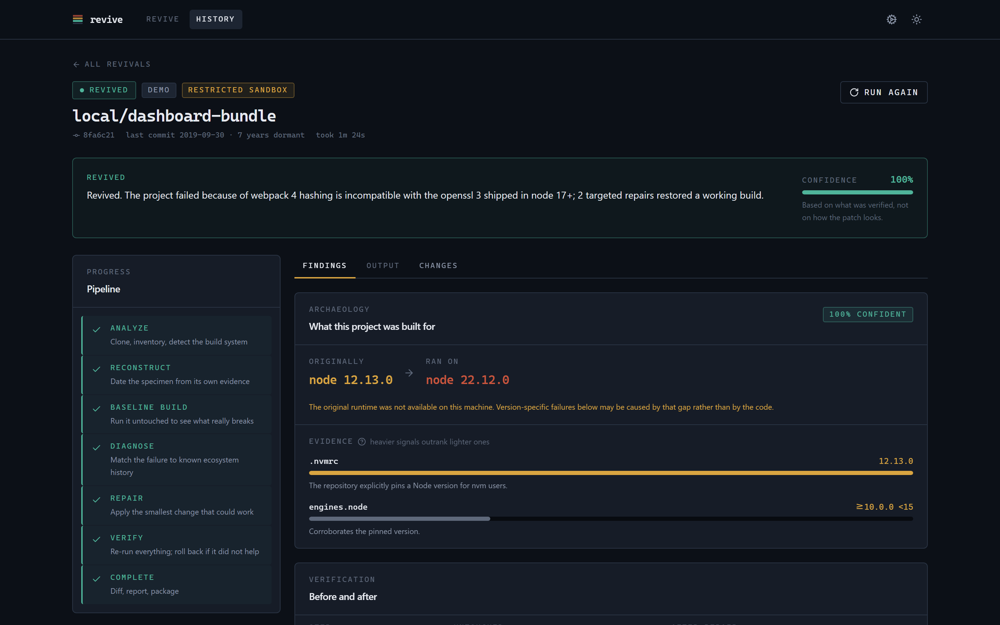
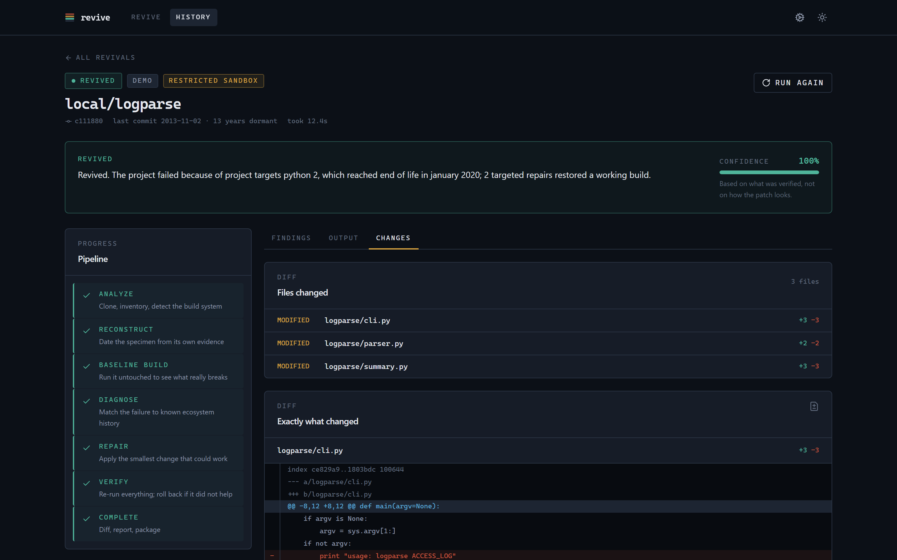
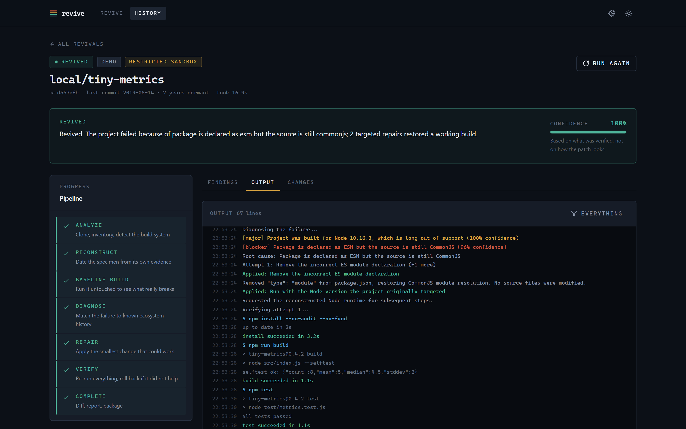

<div align="center">


# Revive

**Paste an abandoned GitHub repo. Revive tries to make it run again.**

Revive works out which runtime a dead project was built for, runs it untouched to see what actually breaks,<br />
applies the smallest repair that fixes it, and proves the result builds and passes its own tests.

[](https://github.com/TheAgencyMGE/revive/actions/workflows/ci.yml)


<a href="docs/media/revive-demo.mp4">
  
</a>

<sub>▶ <a href="docs/media/revive-demo.mp4">Watch the full-quality demo (MP4)</a></sub>

</div>

---

## Why

Most dead repositories are not badly written. They are **stranded** — built for a Node, a Python, a JDK that no longer exists on your machine. Dependency bots respond by upgrading everything and hoping. Revive does the opposite:

1. **Date the specimen.** Read `.nvmrc`, `engines`, `.python-version`, `pom.xml` targets, `go.mod`, MSRV, CI config, lockfile format and commit dates. Each signal is weighted, so the conclusion comes with an evidence trail you can audit.
2. **Run it untouched.** Install, build, test and start exactly as the author left it. Nothing changes until a real failure exists to point at.
3. **Name the blocker.** Match the output against known ecosystem history — OpenSSL 3 vs webpack 4, npm 7 peer conflicts, removed stdlib modules, JDK release floors.
4. **Repair and verify.** Apply the smallest fix, re-run everything, and keep it only if the project measurably improved. Failed attempts are rolled back — and still reported.

No API keys, accounts, databases or cloud services are required.

## Quick start

```bash
git clone https://github.com/TheAgencyMGE/revive.git
cd revive
npm install && npm run dev
```

Open **http://localhost:3000**. The first start creates the SQLite database and builds the demo repositories automatically.

Requirements: **Node 20+** and **git**. Python, Java, Go and Rust toolchains are optional — Revive detects what is installed and tells you before you start.

<details>
<summary><b>Run with Docker instead</b> (bundles every toolchain)</summary>

```bash
docker compose up --build
```

Data persists in the `revive-data` volume.

</details>

## See it work

| | |
|---|---|
| **The evidence ledger.** Every signal used to date the project, and how much it counted. |  |
| **The smallest change.** A Python 2 project migrated syntax-only and verified by its original tests. |  |
| **Live output.** The real failure, the diagnosis, the repair and the re-run, streamed as it happens. |  |

## Try the demos

Eight real git repositories with backdated commits, each broken a different way. They run through exactly the same engine as any URL you paste — five need no network at all.

| Demo | Language | Real failure | Minimal repair | Files changed |
|---|---|---|---|---|
| **tiny-metrics** | Node | `require is not defined in ES module scope` | Remove a stray `"type": "module"` | 1 line |
| **dashboard-bundle** | Node | `ERR_OSSL_EVP_UNSUPPORTED` | Legacy OpenSSL provider | **none** |
| **retro-ui** | Node | node-sass has no binary | Replace with dart-sass | `package.json` |
| **chart-widgets** | Node | `ERESOLVE` peer conflict | npm 6 peer resolution | **none** |
| **logparse** | Python | `Missing parentheses in call to 'print'` | Syntax-only 2 → 3 migration | 3 files |
| **textutils** | Java | `release version 6 not supported` | Raise target to JDK floor | `pom.xml` |
| **shortlink** | Go | go directive ahead of toolchain | Lower directive | `go.mod` |
| **wordfreq** | Rust | `requires rustc 1.99.0` | Lower declared MSRV | `Cargo.toml` |

## What it handles

<table>
<tr>
<td valign="top" width="50%">

**JavaScript / TypeScript** · npm, yarn, pnpm<br />
node-sass bindings · webpack 4 on OpenSSL 3 · webpack 5 polyfills · npm 7 peer conflicts · `npm ci` lockfile drift · integrity failures · unpublished packages · ESM-only majors · abandoned ESM migrations · Babel 6/7 mixes · native modules · heap exhaustion · watch-mode hangs

</td>
<td valign="top">

**Python** · pip, requirements.txt, Poetry, Pipenv<br />
Python 2 syntax · removed stdlib modules (`imp`, `distutils`, `cgi`…) · setuptools 58 and pip 23 breakage · unsatisfiable pins · interpreters that cannot create a virtualenv

</td>
</tr>
<tr>
<td valign="top">

**Java** · Maven, Gradle, or direct `javac`<br />
Release levels modern JDKs reject · `javax.*` removed in Java 11 · plain-HTTP and jcenter repositories

</td>
<td valign="top">

**Go · Rust** · Go modules, Cargo<br />
Pre-modules layouts · go directives ahead of the toolchain · go.sum drift · unreachable MSRV · lockfile format jumps · edition mismatches

</td>
</tr>
</table>

## Honest by construction

- A test runner that collects **zero tests** is recorded as skipped, never passed.
- Files created by running the project (like a generated lockfile) are **left out of the patch** — only changes a repair is responsible for ship.
- The report keeps the **original diagnosis** even after a successful repair.
- Revive **never edits tests** to make them pass.
- Confidence reflects **what was verified**, not how plausible the patch looks.

## What you get

Every run produces a before/after build matrix, a rich diff viewer, a dependency diff, the full streamed log, and three downloads:

- **Repaired repository** as a ZIP (without dependency trees)
- **`.patch`** you can apply with `git apply`
- **`REVIVAL_REPORT.md`** — findings, evidence, repairs, rolled-back attempts and limitations

Runs are kept in history, can be re-run, and can be cancelled mid-build.

## Security

Every repository is treated as hostile.

- **Input** — only `https://github.com/<owner>/<repo>` is accepted. SSH, `ext::`, `file:`, embedded credentials, custom ports and private or metadata hosts are rejected before git runs.
- **Clone** — argv-only git, `ext::` protocol disabled, symlinks off, host git config and hooks ignored, size and file-count limits.
- **Docker mode** — a fresh container per command with network, memory, CPU and PID limits, all capabilities dropped, read-only root, non-root user.
- **Restricted mode** (no Docker) — no inherited environment, redirected HOME/TMP, timeouts with process-tree kill, output caps and a disk watchdog. Weaker than a container, and the UI says so.
- **Output** — ANSI and control characters stripped, secret-shaped strings redacted, diffs rendered as text, strict CSP.

See [SECURITY.md](SECURITY.md) and [docs/ARCHITECTURE.md](docs/ARCHITECTURE.md#security-model).

## Optional AI

Revive needs no AI. If you add an Anthropic or OpenAI key (gear icon), it is consulted only when no built-in rule recognises a failure. The key stays in the browser tab's session storage, is held in memory for a single run, and is never written to disk, logged, or exposed to repository code.

## Architecture

```
Browser ─► Next.js API ─► SQLite
   ▲ SSE        │
   └── event bus ◄── job queue ──► engine
                                     ├─ detect      language adapters
                                     ├─ environment runtime archaeology
                                     ├─ sandbox     docker · restricted · analysis-only
                                     ├─ classify    failure rules
                                     ├─ repair      registry + planner
                                     └─ report      diff · patch · ZIP · report
```

The engine has no dependency on React, Next or Prisma, so demos, real repositories and tests all run the identical pipeline. Full details in [docs/ARCHITECTURE.md](docs/ARCHITECTURE.md).

## Development

| Command | Purpose |
|---|---|
| `npm run dev` | Start with automatic first-run setup |
| `npm run build && npm start` | Production build |
| `npm test` | Unit tests |
| `npm run test:integration` | Revive every offline demo end to end |
| `npm run test:e2e` | Browser tests (Playwright) |
| `npm run lint` · `npm run typecheck` | Static checks |
| `npm run screens` | Recapture README screenshots from a running instance |

The demo video is a Remotion project in [`video/`](video) — `cd video && npm install && npm run render`.

## Configuration

Nothing is required. [`.env.example`](.env.example) lists optional limits: repository size, timeouts, concurrency and sandbox mode.

## Limitations

- Restricted mode does not cap CPU or memory, or isolate the network. Use Docker for untrusted code you care about.
- Revive uses runtimes already installed (or available via nvm, pyenv, SDKMAN or rustup); it does not download historical runtimes. When the original runtime is missing, the report says so.
- Only public github.com repositories are accepted.
- The Python 2 → 3 repair is syntax-only by design; semantic changes are left for a human.
- Monorepos are revived at their primary project root.

## License

[MIT](LICENSE)
